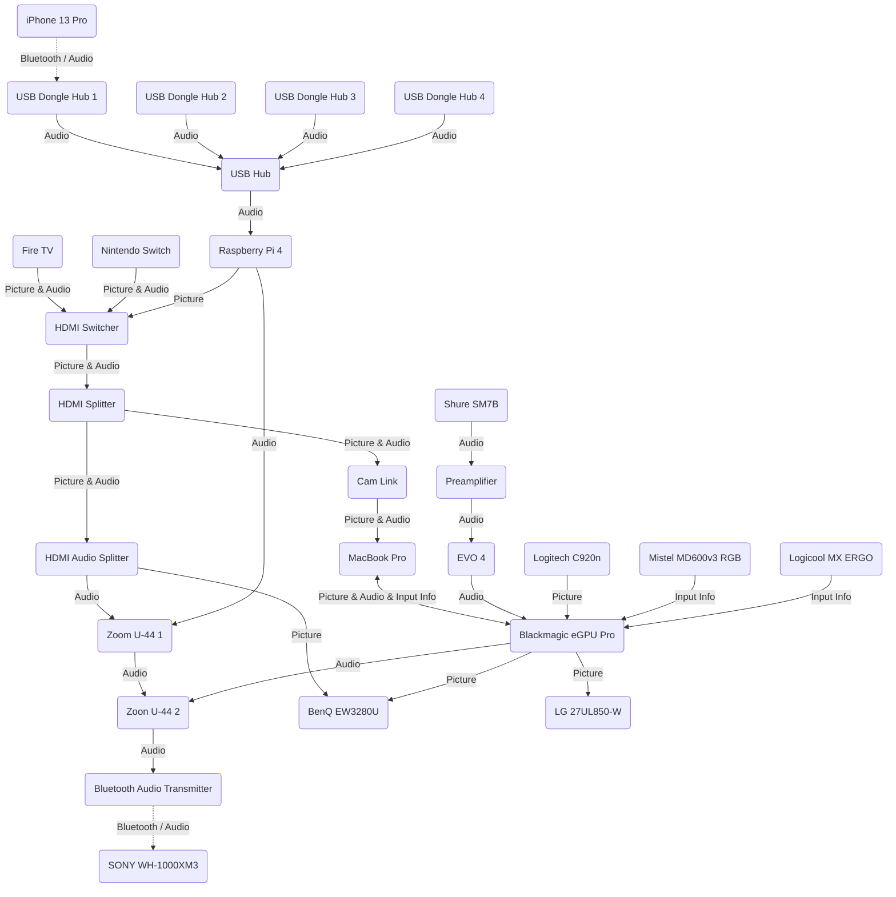

# はじめに
我が家の周辺機器の接続経路が複雑化してきたなと思ったので、ここいらでまとめることにした。せっかくなので公開することにした。

いつも目にしているのでわかってはいたが、改めて図にしてみると結構ごちゃごちゃしている。

| Device                      | Description | Note |
| --------------------------- | ----------- | ---- |
| Fire TV                     | ストリーミングデバイス | • YouTube や VOD を視聴する |
| Nintendo Switch             | ゲーム機 | |
| Raspberry Pi 4              | シングルボードコンピュータ | • オーディオサーバ • DNS サーバ • DHCP サーバ |
| USB Hub                     | | |
| USB Dongle Hub 1            | | |
| USB Dongle Hub 2            | | • Bluetooth 経由で音声を受け取ることができるが今はあまり使われていない |
| USB Dongle Hub 3            | | • Bluetooth 経由で音声を受け取ることができるが今はあまり使われていない |
| USB Dongle Hub 4            | | • Bluetooth 経由で音声を受け取ることができるが今はあまり使われていない |
| HDMI Switcher               | HDMI 切替器 | • ケーブルを抜き差ししなくても映像を切り替えることができる |
| HDMI Audio Splitter         | HDMI 音声分離器 | • 音声を USB-DAC に送ること (ミキシング & ヘッドフォンに音を送ること) ができる • モニターの電源を切っていても音声だけを聴くことができる |
| HDMI Splitter               | HDMI 分配器 | • ゲーム映像録画時に遅延しないフルの映像を見つつ録画もすることができる |
| Zoom U-44 1                 | USB-DAC | • 本当はオーディオインターフェースだが USB-DAC としても使える • 音声入力をミキシングして出力する |
| Zoon U-44 2                 | USB-DAC | (同上) |
| Bluetooth Audio Transmitter | Bluetooth オーディオトランスミッタ | • あらゆる音声が集約されてここに届く |
| SONY WH-1000XM3             | Bluetooth ヘッドフォン | • あらゆる音声を同時に聴くことができる |
| MacBook Pro                 | PC | • 作業用マシン |
| Blackmagic eGPU Pro         | eGPU | • Mac のグラフィック性能を補助する |
| EVO 4                       | オーディオインターフェース | |
| Preamplifier                | プリアンプ | • できる限りノイズを入れずにマイクの音声を増幅する (Shure SM7B は拾う音が小さすぎるので) |
| Shure SM7B                  | ダイナミックマイク | |
| Cam Link                    | キャプチャボード | • ゲームプレイ時に録画する |
| Logitech C920n              | ウェブカメラ | • オンラインミーティング時に使用する |
| Mistel MD600v3 RGB          | キーボード | |
| Logicool MX ERGO            | トラックボール | |
| BenQ EW3280U                | モニター | |
| LG 27UL850-W                | モニター | |
| iPhone 13 Pro               | スマートフォン | |
