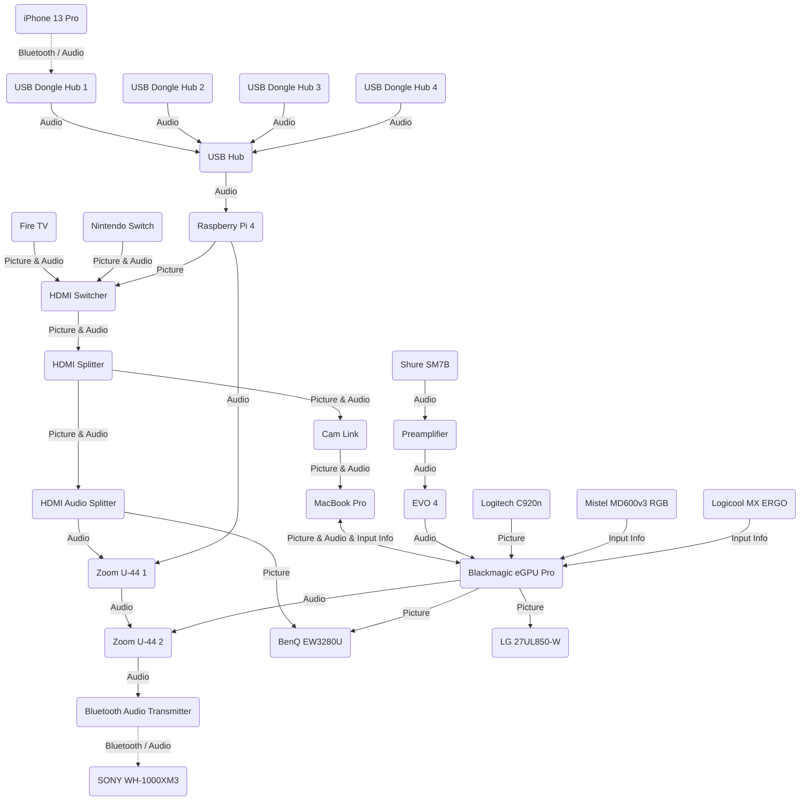

### Introduction
I thought the connection path of the peripheral devices in our home had become quite complex, so I decided to summarize it. Since I went to the trouble, I decided to make it public.

Although I already knew this because I see it every day, seeing it diagrammed anew still makes it look quite cluttered.

| Device                      | Description | Note |
| --------------------------- | ----------- | ---- |
| Fire TV                     | Streaming device | • Used to watch YouTube and VOD |
| Nintendo Switch             | Game console | |
| Raspberry Pi 4              | Single-board computer | • Audio server • DNS server • DHCP server |
| USB Hub                     | | |
| USB Dongle Hub 1            | | |
| USB Dongle Hub 2            | | • Can receive audio via Bluetooth but is not used much now |
| USB Dongle Hub 3            | | • Can receive audio via Bluetooth but is not used much now |
| USB Dongle Hub 4            | | • Can receive audio via Bluetooth but is not used much now |
| HDMI Switcher               | HDMI switcher | • Allows switching of video without having to plug and unplug cables |
| HDMI Audio Splitter         | HDMI audio splitter | • Can send audio to the USB-DAC (for mixing & sending sound to headphones) • Can listen to audio even if the monitor is powered off |
| HDMI Splitter               | HDMI splitter | • Can watch the full video without delay while recording game footage |
| Zoom U-44 1                 | USB-DAC | • Actually an audio interface, but can also be used as a USB-DAC • Mixes audio inputs and outputs |
| Zoom U-44 2                 | USB-DAC | (Same as above) |
| Bluetooth Audio Transmitter | Bluetooth audio transmitter | • All audio is aggregated and sent here |
| SONY WH-1000XM3             | Bluetooth headphones | • Can listen to all audio simultaneously |
| MacBook Pro                 | PC | • Work machine |
| Blackmagic eGPU Pro         | eGPU | • Supports the graphic performance of the Mac |
| EVO 4                       | Audio interface | |
| Preamplifier                | Preamplifier | • Amplifies microphone audio without introducing noise as much as possible (since the Shure SM7B picks up very small sounds) |
| Shure SM7B                  | Dynamic microphone | |
| Cam Link                    | Capture card | • Used to record while gaming |
| Logitech C920n              | Webcam | • Used during online meetings |
| Mistel MD600v3 RGB          | Keyboard | |
| Logicool MX ERGO            | Trackball | |
| BenQ EW3280U                | Monitor | |
| LG 27UL850-W                | Monitor | |
| iPhone 13 Pro               | Smartphone | |
